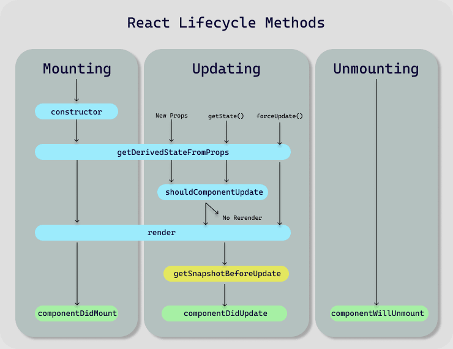

### React 3-dars

- Composition
- Component Lifecycle
- list and keys

### Composition React-da composition (kompozitsiya) — bu komponentlarni kichikroq, qayta ishlatiladigan bo‘laklarga ajratib, ularni birlashtirish orqali murakkab foydalanuvchi interfeyslarini yaratish usulidir. Bu yondashuvda meros olish o‘rniga komponentlar bir-birining ichida joylashtiriladi yoki funksiyalar yordamida birlashtiriladi, bu esa kodni qayta ishlatish va boshqarishni osonlashtiradi.

```
import React from 'react';

// Kichik komponent: Button
function Button(props) {
  return <button style={{ backgroundColor: props.color }}>{props.children}</button>;
}

// Katta komponent: Dialog, Button komponentini ichida ishlatadi
function ExampleComposition(props) {
  return (
    <div style={{ border: '2px solid blue', padding: '10px' }}>
      <h3>{props.title}</h3>
      <p>{props.message}</p>
      {/* Button komponenti composition orqali qo'shilmoqda */}
      <Button color="green">OK</Button>
    </div>
  );
}

// Ilova asosiy komponenti
function App() {
  return (
    <div>
      <ExampleComposition title="Salom!" message="Bu React composition misoli." />
    </div>
  );
}

export default App;
```

### React-da Component Lifecycle (komponent hayotiy sikli) — bu komponentning yaratilishi, yangilanishi va o‘chirilishi jarayonlarida avtomatik ravishda chaqiriladigan maxsus metodlar yoki hooklar majmuasidir. Ular yordamida ishlab chiquvchilar komponentning turli bosqichlarida kerakli kodlarni bajarishlari mumkin.

```
import React, { useState, useEffect } from 'react';

function MyComponent() {
  const [count, setCount] = useState(0);

  useEffect(() => {
    // Mounting va Updating bosqichlari uchun
    console.log('Component mounted or updated');

    return () => {
      // Unmounting bosqichi uchun tozalash funksiyasi
      console.log('Component will unmount');
    };
  }, [count]); // count o'zgarganda useEffect qayta ishga tushadi

  return (
    <div>
      <p>Count: {count}</p>
      <button onClick={() => setCount(count + 1)}>Increase</button>
    </div>
  );
}

```

### React-da list — bu bir nechta elementlarni ketma-ket ko‘rsatish uchun ishlatiladigan komponentlar to‘plamidir. List yaratishda odatda JavaScript-ning map() funksiyasi yordamida massivdagi har bir element uchun React elementlari yaratiladi.

### React-da list elementlarini yaratishda har bir elementga unique (takrorlanmas) key berish juda muhim. key React-ga qaysi element o‘zgarganini, qo‘shilganini yoki o‘chirganini aniq aniqlashga yordam beradi va shu orqali samarali yangilanishni ta’minlaydi.

```
function NumberList() {
  const numbers = [1,2,3,4,5,6,7];
  return(
  <>
    <h1>React Render bo'yicha misol</h1>
      <ul className="list">
        {numbers.map((number) => (
          <li className="list-item" key={number.toString()}>
            {number}
          </li>
        ))}
      </ul>
  </>
  )
}
```
