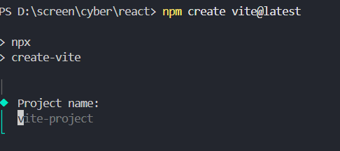
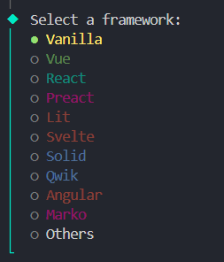
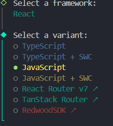
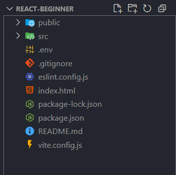
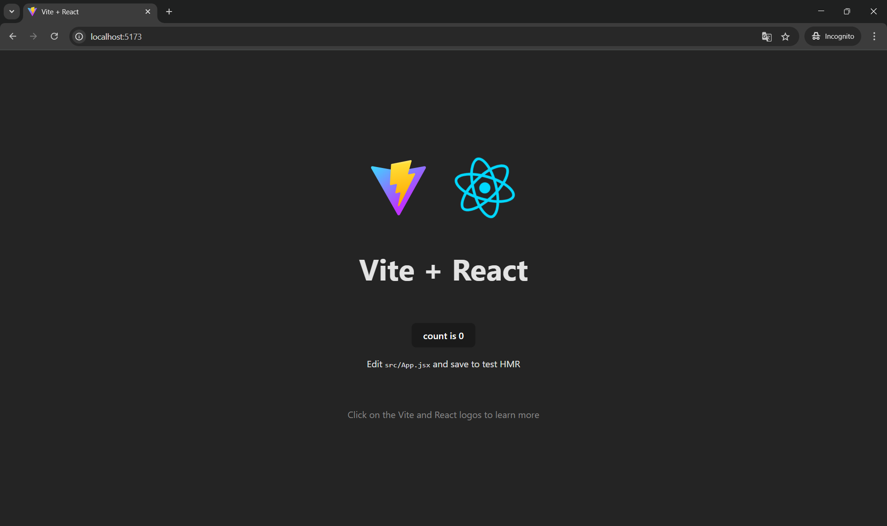

# React darsi
# ! React js 19.1.0 versiyasi ishlatildi.
## Birinchi react js da code yozishdan oldin biz muhitni sozlashimiz kerak.

- IDE sozlash 
- Node JS ni o'rnatish
- CMD bilan ishlash ko'nikmalari kerak bo'ladi 

### IDE lar ulardan birini kompyuteringizga o'rnating 
- VS code [havola](https://code.visualstudio.com/) 
- Web Storm  [havola](https://www.jetbrains.com/)
- Sublime Text [havola](https://www.sublimetext.com/)

### Node js yuklab oling [havola](https://nodejs.org/en/download)
o'rnatish bo'yicha video qo'lnama [havola](https://www.youtube.com/watch?v=dlNT6I33mOc)

### CMD bilan ishlash uchun muhim buyruqlar.
`ls
` bu orqali siz qayerda turganingni aniqlab olishingiz mumkin.

`cd /manzil
` bu orqali bir papkadan boshqa papka kirish mumkin.

`cd ..
` bu orqali orqali siz papkadan chiqishingiz mumkin.

`node -v
` bu buyruq orqali siz kompyuteringizga nodejs o'rnatilgan yoki yo'qligini aniqlashingiz mumkin. 

`npm -v
` bu buyruq orqali siz kompyuteringizga npm package  o'rnatilgan yoki yo'qligini aniqlashingiz mumkin.

# Agar sizda shu joygacha muamo bo'lmasa keyingi qismiga o'tishingiz mumkin!

### Endi React js haqida gaplashamiz bu foydalanuvchi interfeyslarini yaratish uchun mo‘ljallangan ochiq manbali JavaScript kutubxonasi 2013 yil Facebook company tomonidan omaga taqdim etilgan. [React tarixi bo'yicha documetatsiya](https://youtu.be/8pDqJVdNa44?si=rs9tpqF9ekrYhr4O)
### React komponentlarga asoslangan arxitekturaga ega bo‘lib, bu dasturchilarga qayta foydalanish mumkin bo‘lgan, mustaqil UI komponentlarini yaratish imkonini beradi. Bu yondashuv kodni modulli va barqaror qiladi hamda ishlab chiqish jarayonini tezlashtiradi. React yordamida bir sahifali veb-saytlar va mobil ilovalar ishlab chiqish mumkin.

### React ni kompyuterga sozlash buning uchun quyidagi bosqichlar bilan ishlaymiz
- `npm create @vitelatest` bu buyruq orqali react muhiti o'rnatamiz.

loyihamizga nom beramiz yoki ./ enter qilib keyingi bosqichga o'tamiz.

bu joydan reactni tanlaymiz!

o'zimizga kerak bo'lagini  tanlaymiz.

### bizga faylar kelganida so'ng
- `npm i` yoki `npm install` buyrug'ini terminalga kiritamiz. ish yakunlangandan so'ng
- `npm run dev` orqali react loyihamizni ishga tushuramiz!
- `http://localhost:5173/` web browserda shu manzilga kiramiz. 

### agar sizda ham shu oynani ochgan bo'lsa barcha ishni to'g'ri bajardingiz.